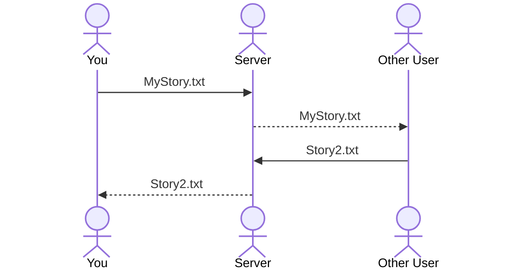

# Story Date

[My Notes](notes.md)

## 🚀 Specification Deliverable

For this deliverable I did the following. I checked the box `[x]` and added a description for things I completed.

- [x] Proper use of Markdown
- [x] A concise and compelling elevator pitch
- [x] Description of key features
- [x] Description of how you will use each technology
- [x] One or more rough sketches of your application. Images must be embedded in this file using Markdown image references.

### Elevator pitch

It is hard to come up with ideas for creative dates, so why not let a story create that for you. Story Date is a place where people can share their "choose your own adventure" stories with others. With these stories, people can select one and come up with a list of activities, dinners, desserts, and movies to attach to the different choices in the story. As you and your date (or your group), read through the story and make your choices, you are creating a unique date for you to do as well as enjoying the story contributions of others. _(Future additions to this will be a way to randomly select the options to attach to the story based on local information.)_

### Design

This sequence diagram shows how people will be able to add their own stories and how they will be able to see other people's stories. 

### Key features

- Secure login
- Create/Upload your own stories
- Access other submitted stories
- Collaborate on stories

### Technologies

I am going to use the required technologies in the following ways.

- **HTML** - Use HTML to strcture the webpage. Three HTML pages for login, instructions, and adding/accessing stories. There will be hyperlinks to jump between pages. 
- **CSS** - Styling the pages to make them look simple and easy to read. Choosing colors and fonts to organize and make the website look good. 
- **React** - Allows buttons for adding files to work and makes the login work. 
- **Service** - Using other services for:
    - Login
    - Submitting/Sharing Files
    - Maps to plan date
- **DB/Login** - Save and store login info in a secure database. Can't submit stories without being logged in. Register and Login users to access stories.
- **WebSocket** - All public stories can be accessed and read by other users.

## 🚀 AWS deliverable

For this deliverable I did the following. I checked the box `[x]` and added a description for things I completed.

- [x] **Server deployed and accessible with custom domain name** - [My server link](https://storydate.click/).

## 🚀 HTML deliverable

For this deliverable I did the following. I checked the box `[x]` and added a description for things I completed.

- [x] **HTML pages** - 5 HTML pages used for login, instructions, accessing stories, submitting stories, and reading stories (this one will not be contained in the menu because you need to select a story from the stories page first)
- [x] **Proper HTML element usage** - I used many elements to be able to organize the page and take input.
- [x] **Links** - I have a menu that allows you to jump between pages. There are also links within the instructions to take you to the story page and to give you more information. The submission buttons on most pages will also link you to another page. 
- [x] **Text** - There is a lot of text giving clear instructions on how to do a story date and how to use the website. There is also places where the stories will be written and be able to be read in the future. 
- [x] **3rd party API placeholder** - For this, I included a link that doesn't work right now on the instruction page where I will link it to a google maps API to help the user find nearby locations as options for their date. 
- [x] **Images** - At the moment, I have one image uploaded on the instruction page as an example of the structure for an idea to use envelopes to organize the date. I hope to add some more visuals later, but this is the only one I had at the moment. 
- [x] **Login placeholder** - On the home page, I have a login placeholder with a login button and a create account button to submit. The user info will be displayed in place of the "New User" text on each page. 
- [x] **DB data placeholder** - On the stories page, I have 3 radio buttons as a placeholder for a story file. These will be files submitted by users, and each user will be able to select a file and read the story. These will be pulled from a database.
- [x] **WebSocket placeholder** - The stories page will be updated with new stories in real time as new stories are added by other users.

## 🚀 CSS deliverable

For this deliverable I did the following. I checked the box `[x]` and added a description for things I completed.

- [x] **Header, footer, and main content body** - On every page, there is a header with a navigation bar and a footer with information about the author
- [x] **Navigation elements** - These are found mostly on the navigation bar in the header. There are also additional navigation elements found in links in the instructions, the 'Begin Date!' buttons on the stories page, and the 'Add your own story' button also on that page
- [x] **Responsive to window resizing** - As the window is resized, the navigation bar will switch from row to column, and elements on the page will wrap. The story cards will change grid formatting and adjust how many are in a row. On the Add a story page, the text boxes will resize according to screen size. 
- [x] **Application elements** - Used contrast and whitespace to keep the website clean. I also included a more stylized way to select options when you read a story (it will highlight the option rather thann just select a radio button). I also included a button to add your own story that stays in the same place as you scroll. 
- [x] **Application text content** - Consistent fonts, and elements of bolding at italics to highlight different parts. 
- [x] **Application images** - I included a placeholder image for the map API on the instruction page (both resize with the window), and I also added an image as a logo at the top of the page and on the tab of the website. 

## 🚀 React part 1: Routing deliverable

For this deliverable I did the following. I checked the box `[x]` and added a description for things I completed.

- [x] **Bundled using Vite** - Done!
- [x] **Components** - I have the stories buttons now navigate to pages with their specific IDs so they can be different later. I have components for each of my pages (login, instructions, stories, ReadStories, and SubmitStory).
- [x] **Router** - I have routing in the navigation bar on the top of the screen between the different tabs as well as navigation with a link on the instructions page and the buttons on the stories page.

## 🚀 React part 2: Reactivity

For this deliverable I did the following. I checked the box `[x]` and added a description for things I completed.

- [x] **All functionality implemented or mocked out** - I got everything to work. I have authentication that only allows you to access certain pages when logged in. I made use of local storage to be able to create a story in the submit story page. It will then create a card for that story on the stories page. Accessing that story, you can read through the different options. I do not have a hardcoded example, so to test it, you will have to create your own basic story. Submitting the story also clears the correct textboxes and allows you to go backward and forward in your story.
- [x] **Hooks** - These are used throughout my pages, but especially on the submitting story page. I used useState a lot but especially for the titles of the textboxes to change. I also used useEffect to make sure variables were changed before initializing the values in the textbox. I used the same hooks on other pages as well. 

## 🚀 Service deliverable

For this deliverable I did the following. I checked the box `[x]` and added a description for things I completed.

- [ ] **Node.js/Express HTTP service** - I did not complete this part of the deliverable.
- [ ] **Static middleware for frontend** - I did not complete this part of the deliverable.
- [ ] **Calls to third party endpoints** - I did not complete this part of the deliverable.
- [ ] **Backend service endpoints** - I did not complete this part of the deliverable.
- [ ] **Frontend calls service endpoints** - I did not complete this part of the deliverable.

## 🚀 DB/Login deliverable

For this deliverable I did the following. I checked the box `[x]` and added a description for things I completed.

- [ ] **User registration** - I did not complete this part of the deliverable.
- [ ] **User login and logout** - I did not complete this part of the deliverable.
- [ ] **Stores data in MongoDB** - I did not complete this part of the deliverable.
- [ ] **Stores credentials in MongoDB** - I did not complete this part of the deliverable.
- [ ] **Restricts functionality based on authentication** - I did not complete this part of the deliverable.

## 🚀 WebSocket deliverable

For this deliverable I did the following. I checked the box `[x]` and added a description for things I completed.

- [ ] **Backend listens for WebSocket connection** - I did not complete this part of the deliverable.
- [ ] **Frontend makes WebSocket connection** - I did not complete this part of the deliverable.
- [ ] **Data sent over WebSocket connection** - I did not complete this part of the deliverable.
- [ ] **WebSocket data displayed** - I did not complete this part of the deliverable.
- [ ] **Application is fully functional** - I did not complete this part of the deliverable.
